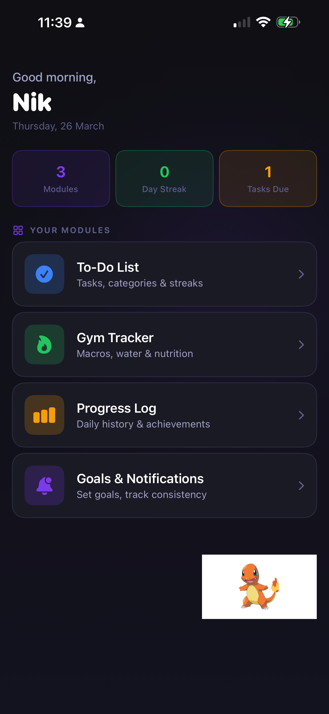
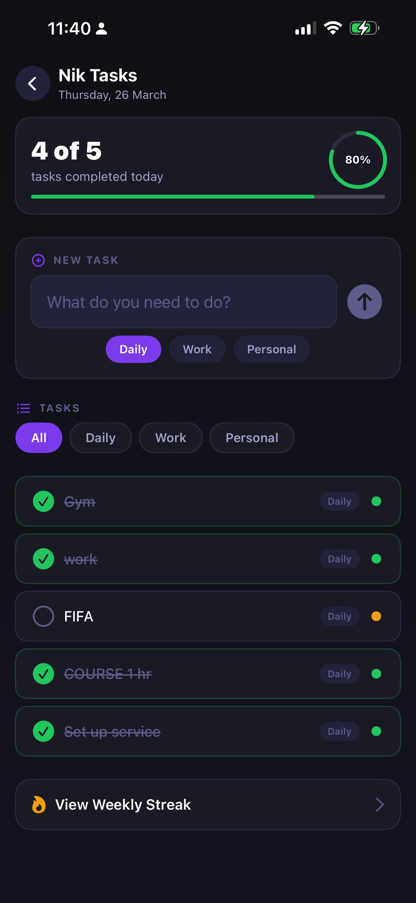
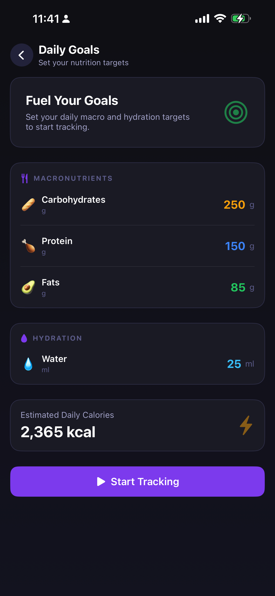
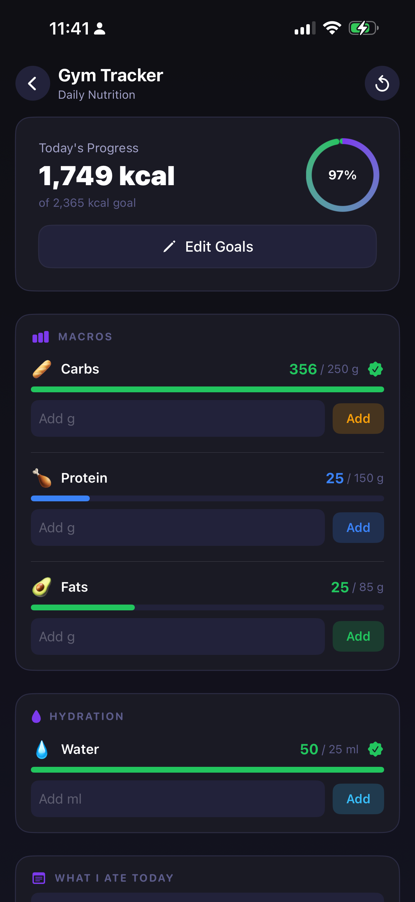
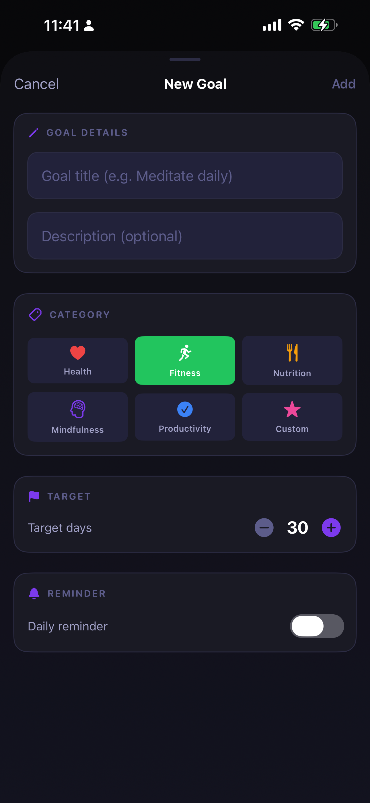
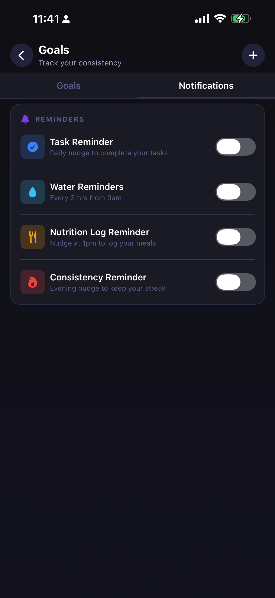

# Dexify

A comprehensive personal wellness and productivity tracker for iOS, built with SwiftUI. Dexify combines task management, fitness tracking, nutrition logging, and habit consistency tracking — all wrapped in a sleek dark-themed interface designed to help you build streaks and achieve your goals and a Charmander to motivate you while youre on the go.

## Features

### To-Do List
- Create and manage tasks across categories (Daily, Work, Personal)
- Track status as Completed, Ongoing, or Not Today
- Daily auto-reset for recurring tasks
- Circular progress ring showing completion percentage
- Weekly streak tracking

### Nutrition Tracker
- Set daily macro targets (carbs, protein, fat) and hydration goals
- Log intake with real-time progress bars and automatic calorie calculation
- Free-form meal notes
- Goal completion notifications when all daily targets are met

### Progress Log
- Historical view of all completed nutrition entries
- Expandable day entries showing macro breakdowns and meal notes
- Summary stats: total days logged, best streak, and weekly count

### Goals & Notifications
- Create custom goals with target day counts and daily reminders
- Track current and longest streaks with a 30-day consistency heatmap
- Daily check-in system with completion rate tracking
- Configurable reminders for tasks, water intake, nutrition logging, and consistency

#### Creating a Custom Notification / Goal

1. Navigate to **Goals & Notifications** from the home screen.
2. Tap the **+** button in the top-right corner to open the *New Goal* sheet.
3. Fill in the **Goal Details**:
   - **Goal title** — a short name (e.g. *Meditate daily*).
   - **Description** *(optional)* — extra context for the goal.
4. Select a **Category**: Health, Fitness, Nutrition, Mindfulness, Productivity, or Custom.
5. Set the **Target** — use the **−** / **+** stepper to choose how many days you want to maintain the goal (default: 30).
6. Toggle **Daily reminder** on if you want a push notification each day to keep you on track.
7. Tap **Add** to save the goal.

#### Built-in System Reminders

Switch to the **Notifications** tab inside Goals & Notifications to toggle any of the four system-level reminders:

| Reminder | Schedule | Purpose |
|----------|----------|---------|
| **Task Reminder** | Daily | Nudge to complete your to-do tasks |
| **Water Reminders** | Every 3 hrs from 9 am | Stay hydrated throughout the day |
| **Nutrition Log Reminder** | 1 pm daily | Log your meals before the day slips by |
| **Consistency Reminder** | Evening | Evening nudge to protect your streak |

Notification permissions are requested on first launch via `NotificationManager`. All reminders use `UNUserNotificationCenter` with calendar-based triggers and can be toggled at any time without leaving the app.

## Screenshots

| Home | To-Do List | Daily Goals |
|------|------------|-------------|
|  |  |  |

| Gym Tracker | New Goal | Notifications |
|-------------|----------|---------------|
|  |  |  |

## Requirements

- iOS 17.0+
- Xcode 15.0+
- Swift 5.9+

## Getting Started

1. Clone the repository
   ```bash
   git clone https://github.com/your-username/Dexify.git
   ```
2. Open `Dexify.xcodeproj` in Xcode
3. Build and run on a simulator or device

## Architecture

- **UI Framework:** SwiftUI
- **State Management:** `@State`, `@Binding`, `@StateObject`, `@AppStorage`, `@ObservedObject`
- **Persistence:** UserDefaults with JSON encoding
- **Notifications:** UNUserNotificationCenter with calendar-based triggers
- **Design System:** Custom token-based system with a dark color palette, spacing scale, radius scale, and reusable components (`DexCard`, `DexPrimaryButton`, `DexTextField`, `DexNavBar`, etc.)

## Project Structure

```
Dexify/
├── DexifyApp.swift              # App entry point
├── Info.plist
├── Assets.xcassets/
└── Views/
    ├── AppEntryView.swift       # Root navigation & state management
    ├── LaunchScreenView.swift   # First-launch onboarding
    ├── ModuleSelectionView.swift # Main hub / module picker
    ├── SelectedModule.swift     # Module enum definition
    ├── ChecklistView.swift      # To-Do list module
    ├── GymTrackerView.swift     # Gym tracker entry (routes to goal input or nutrition)
    ├── GoalInputView.swift      # Set daily macro & hydration targets
    ├── NutritionTrackerView.swift # Log daily nutrition intake
    ├── ProgressLogView.swift    # Historical nutrition log
    ├── NotificationsView.swift  # Goals & notification settings
    ├── NotificationManager.swift # Local notification scheduling
    ├── DesignSystem.swift       # Colors, spacing, radii, gradients & components
    └── DinosaurView.swift       # Animated mascot
```

## License

This project is for personal use.
